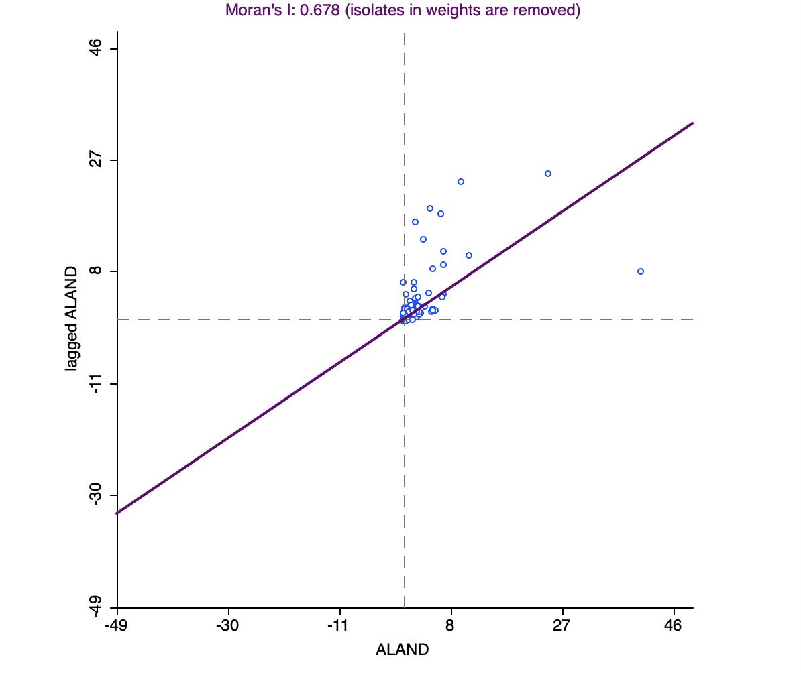
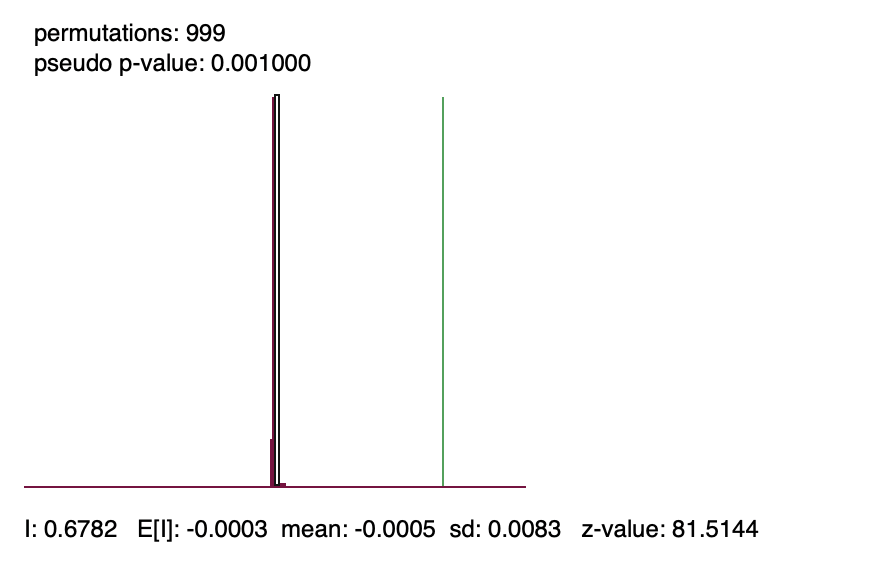
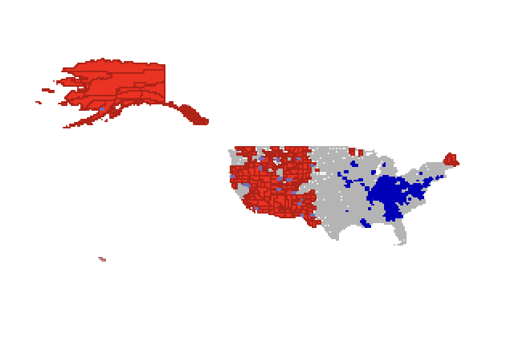
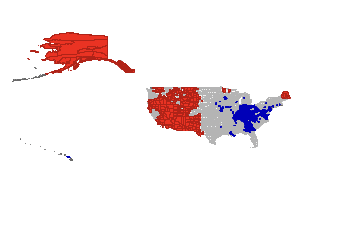

## Find a polygon shapefile with at least 50 polygons that contains at least one interesting variable that you will examine in questions 2 and 3. (Do not use data from one of the Module 4 exercises.)

### Read the shapefile into an object in R – you might have to make sure that it is a spatial object.
```{r}
library(tigris)
library(sf)
library(tmap)
library(spdep)
library(dplyr)
library(stringr)
library(sp)
library(units)
```


### Use qtm to generate a plot of your study region.

```{r}

counties <- counties(cb = TRUE, year = 2020) %>%
  st_transform(crs = 4326)


states_50 <- str_pad(seq(1, 56), width = 2, side = "left", pad = "0")
exclude <- c("03", "07", "14", "43", "52") 
states_50 <- setdiff(states_50, exclude)

contiguous_plus <- counties %>%
  filter(STATEFP %in% states_50)

bbox <- st_bbox(c(xmin = -180, xmax = -65, ymin = 18, ymax = 72), crs = st_crs(contiguous_plus))

cropped <- st_crop(contiguous_plus, bbox)

qtm(cropped, fill = "ALAND") +
  tm_layout(frame = TRUE, asp = 0)

```


### Use the functions within spdep to generate queen and rook contiguity neighbors (order 1) for your study region. Provide summary statistics for your rook and queen neighbor objects and plot your two neighbor maps.

```{r}
counties_sp <- as_Spatial(counties)
cropped_sp <- as_Spatial(cropped)

queen_nb <- poly2nb(cropped_sp, queen = TRUE)
summary(queen_nb)
rook_nb  <- poly2nb(cropped_sp, queen = FALSE)
summary(rook_nb)

queen_lines <- nb2lines(queen_nb, coords = coordinates(cropped_sp), proj4string = CRS(st_crs(cropped)$proj4string))
rook_lines  <- nb2lines(rook_nb, coords = coordinates(cropped_sp), proj4string = CRS(st_crs(cropped)$proj4string))

queen_sf <- st_as_sf(queen_lines)
rook_sf  <- st_as_sf(rook_lines)

tm_shape(cropped) +
  tm_polygons("ALAND", alpha = 0.6, border.alpha = 0.2) +
  tm_shape(queen_sf) +
  tm_lines(col = "blue", lwd = 0.4) +
  tm_layout(title = "Queen Contiguity Links", frame = FALSE)

tm_shape(cropped) +
  tm_polygons("ALAND", alpha = 0.6, border.alpha = 0.2) +
  tm_shape(rook_sf) +
  tm_lines(col = "red", lwd = 0.4) +
  tm_layout(title = "Rook Contiguity Links", frame = FALSE)

```

### Generate and plot the first-order nearest neighbors for your study region.

```{r}

coords <- coordinates(cropped_sp)

knn_1 <- knearneigh(coords, k = 1)
nb_knn_1 <- knn2nb(knn_1)

knn_lines <- nb2lines(nb_knn_1, coords = coords, proj4string = CRS(st_crs(cropped)$proj4string))
knn_sf <- st_as_sf(knn_lines)

# 3. Plot with tmap
tm_shape(cropped) +
  tm_polygons("ALAND", alpha = 0.5) +
  tm_shape(knn_sf) +
  tm_lines(col = "darkgreen", lwd = 0.6) +
  tm_layout(title = "First-Order Nearest Neighbors", frame = FALSE)

```

### Generate a set of distance weights for your study region and use them to identify the most accessible polygon within your study region and the most remote polygon within your study region. Explain your logic.

```{r}
coords <- coordinates(cropped_sp)

dist_nb <- dnearneigh(coords, d1 = 0, d2 = 100000) 

neighbor_counts <- card(dist_nb)

most_accessible_index <- which.max(neighbor_counts)
most_remote_index <- which.min(neighbor_counts[neighbor_counts > 0]) 

most_accessible <- cropped$NAME[most_accessible_index]
most_remote <- cropped$NAME[most_remote_index]

cat("Most accessible polygon (most neighbors within 100 km):", most_accessible, "\n")
cat("Most remote polygon (fewest non-zero neighbors within 100 km):", most_remote, "\n")
```

To assess spatial accessibility across the study region, we use a set of distance-based spatial weights, where each polygon is considered a neighbor of another if it lies within a fixed distance threshold such as 100 kilometers. This creates a spatial network based not on shared borders but on geographic proximity. We then count how many neighboring polygons each unit has under this rule. The most accessible polygon is the one with the greatest number of nearby neighbors, indicating high spatial connectivity and closeness to other regions. In contrast, the most remote polygon is the one with the fewest nonzero neighbors, suggesting geographic isolation and limited spatial interaction. This method highlights the role of physical distance in shaping spatial relationships, especially in areas with irregular or widely spaced units.


## Using the polygon shapefile identified in question 1

### Select a variable of interest and map your variable with tmap. Show the map in your output and interpret what you see.

```{r}
tm_shape(cropped) +
  tm_fill("ALAND", 
          palette = "YlGnBu", 
          style = "quantile", 
          title = "Land Area (sq meters)") +
  tm_borders(alpha = 0.3) +
  tm_layout(title = "County Land Area Across the United States",
            legend.outside = TRUE)
```

This map shows the distribution of land area across U.S. counties. Larger counties, especially those in the western states like Alaska, Texas, and Montana, appear in darker shades, indicating higher land area. In contrast, counties in the northeastern U.S., such as those in New Jersey, Rhode Island, and Massachusetts, appear in lighter shades, reflecting their smaller land areas. The pattern reflects how county size varies geographically, with western counties tending to be significantly larger than those in the east due to historical patterns of land division and settlement density.

### Using the queen contiguity weights of question 1, generate a global Moran’s I scatterplot for your variable of interest. Show and interpret the scatterplot.

```{r}
queen_listw <- nb2listw(queen_nb, style = "W", zero.policy = TRUE)

moran.plot(cropped$ALAND, listw = queen_listw, 
           xlab = "Land Area (raw)", 
           ylab = "Spatial Lag of Land Area",
           main = "Moran's I Scatterplot: Land Area",
           pch = 20, col = "darkblue")
```


The Moran’s I scatterplot for county land area shows a clear positive relationship between each county’s land size and the average land size of its neighbors. This indicates positive spatial autocorrelation—large counties are typically near other large counties, while small counties are near other small ones. The clustering pattern reflects geographic trends, with larger counties concentrated in the western U.S. and smaller ones in the east. Overall, the spatial distribution of land area is clearly not random.


### Perform a test of the hypothesis that the spatial distribution of the values of your variable of interest is random. Show your results and interpret them.

```{r}
moran_test_result <- moran.test(cropped$ALAND, listw = queen_listw, zero.policy = TRUE)

print(moran_test_result)
```

The Global Moran’s I test yields a Moran’s I value of approximately 0.678 with a very small p-value (less than 2.2e-16), indicating strong positive spatial autocorrelation. Since the observed statistic is much greater than expected under spatial randomness, we reject the null hypothesis. This confirms that counties with similar land areas are clustered together rather than randomly distributed across the United States.

## For the shape file and variable used in questions 1 and 2, read the data (shape file) into GeoDa.

### Generate a set of queen contiguity weights in GeoDa (order 1).

### Generate the global Moran’s I scatterplot (again) for your variable of interest and then generate a cluster map of LISA statistics for the same variable. Show the scatterplot and LISA cluster map. For any obvious clusters, discuss the positions of the polygons in the Global Moran I plot and interpret your analysis.


\newpage




The Global Moran’s I scatterplot shows a strong positive linear relationship between county land area and the spatial lag of land area. Most points are concentrated in the lower-left and upper-right quadrants, indicating that counties with small land areas are surrounded by other small counties, and large counties tend to be near other large counties. This spatial clustering is confirmed by the Moran’s I statistic of 0.678, which is highly significant (z = 81.51, p-value < 0.001), as shown in the permutation test histogram.

The LISA cluster map further reveals local patterns of spatial association. High-High clusters (in red) appear primarily in Alaska and across the western United States, highlighting regions where large counties group together. Low-Low clusters (in blue) are mainly found in the Southeast and parts of the Northeast, where counties with small land areas are surrounded by similar small counties. Gray areas indicate locations with no statistically significant local spatial autocorrelation.

Together, the Moran’s I scatterplot and LISA map confirm that the spatial distribution of county land area in the United States is non-random and exhibits both global and local spatial clustering patterns.


### Generate Getis-Ord local G-statistics (not G*), map and show the resulting clusters and relate those to your LISA plots. Are the local measures consistent with one another? If there are any significant differences, point them out and explain why they differ.



The Getis-Ord G map shows clear hot spots of large counties in the western U.S. and Alaska, and cold spots of small counties in the Southeast and Northeast. These clusters are consistent with the LISA map's High-High and Low-Low areas. However, unlike LISA, Getis-Ord G does not detect spatial outliers like High-Low or Low-High patterns. This difference arises because LISA captures local dissimilarity, while Getis-Ord G focuses on the intensity of clustering.


