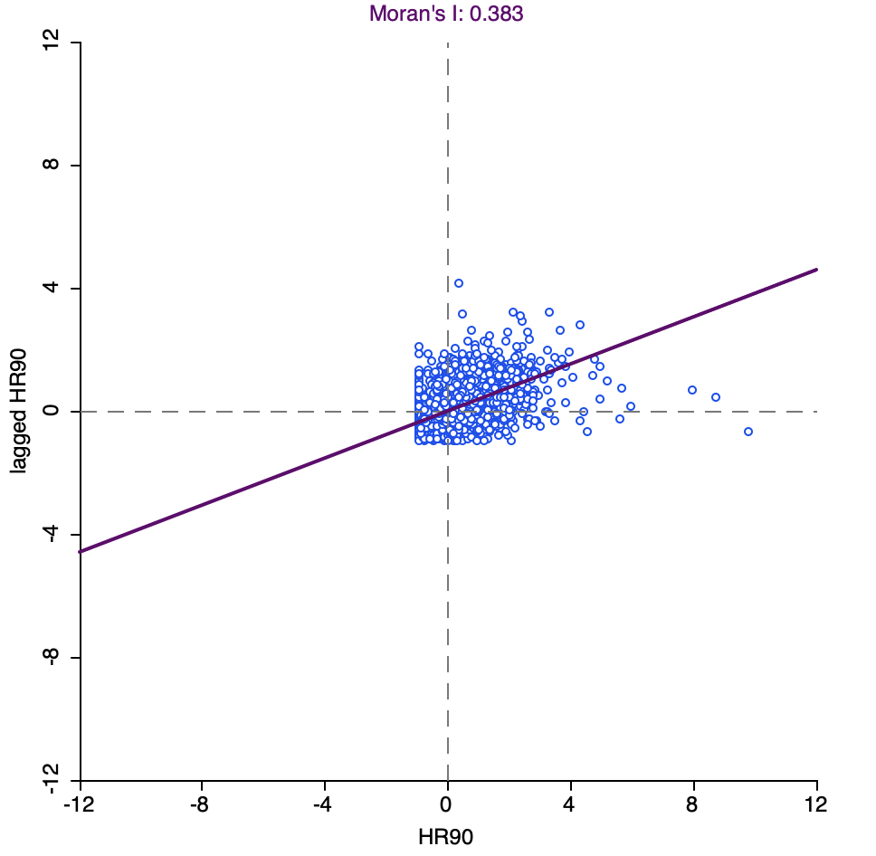
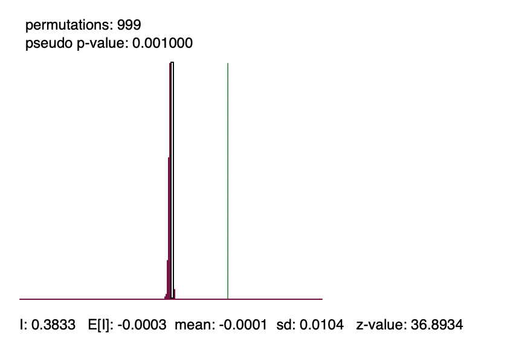
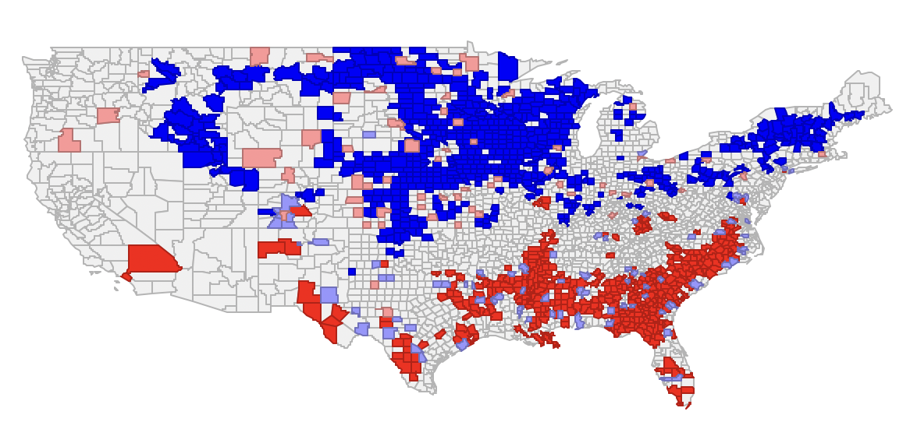
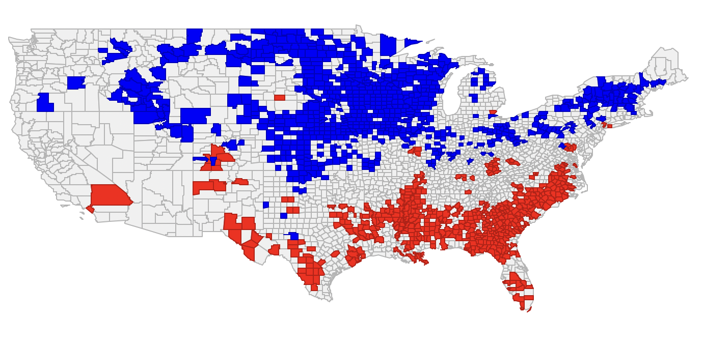

## Find a polygon shapefile with at least 50 polygons that contains at least one interesting variable that you will examine in questions 2 and 3. (Do not use data from one of the Module 4 exercises.)

### Read the shapefile into an object in R – you might have to make sure that it is a spatial object.
```{r}
library(geodaData)
library(sf)
library(dplyr)
library(stringr)
library(sp)
library(units)
library(tmap)
library(spdep)
```

### Use qtm to generate a plot of your study region.

```{r}

data("ncovr")

qtm(ncovr, fill = "HR90", title = "Homicide Rate by County (1990)")

```


### Use the functions within spdep to generate queen and rook contiguity neighbors (order 1) for your study region. Provide summary statistics for your rook and queen neighbor objects and plot your two neighbor maps.

```{r}
ncovr <- st_make_valid(ncovr)
ncovr_sp <- as(ncovr, "Spatial")

queen_nb <- poly2nb(ncovr_sp, queen = TRUE)
rook_nb <- poly2nb(ncovr_sp, queen = FALSE)

summary(queen_nb)
summary(rook_nb)

plot(ncovr_sp, border = "lightgray", main = "Queen Contiguity")
plot(queen_nb, coordinates(ncovr_sp), col = "blue", add = TRUE)
plot(ncovr_sp, border = "lightgray", main = "Rook Contiguity")
plot(rook_nb, coordinates(ncovr_sp), col = "red", add = TRUE)

```

### Generate and plot the first-order nearest neighbors for your study region.

```{r}

coords <- coordinates(ncovr_sp)
knn_nb <- knn2nb(knearneigh(coords, k = 1))

plot(ncovr_sp, border = "lightgray", main = "First-Order Nearest Neighbors")
plot(knn_nb, coords, col = "darkgreen", add = TRUE)
```

### Generate a set of distance weights for your study region and use them to identify the most accessible polygon within your study region and the most remote polygon within your study region. Explain your logic.

```{r}
dist_matrix <- as.matrix(dist(coords))
diag(dist_matrix) <- NA
inv_dist_matrix <- 1 / dist_matrix
accessibility_scores <- rowSums(inv_dist_matrix, na.rm = TRUE)

most_accessible_index <- which.max(accessibility_scores)
most_remote_index <- which.min(accessibility_scores)

cat("Most Accessible Polygon Index:", most_accessible_index, "\n")
cat("Most Remote Polygon Index:", most_remote_index, "\n")
```

To identify the most accessible and most remote polygons in the study region, I calculated a matrix of Euclidean distances between the centroids of all polygons. Then, I computed an accessibility score for each polygon by summing the inverse of its distances to all other polygons—this captures how close each polygon is, on average, to all others. A higher accessibility score means a polygon is surrounded by many nearby neighbors, making it more central or accessible. Conversely, a lower score indicates that a polygon is far from most others, making it the most spatially isolated or remote. This method provides a global measure of spatial accessibility based purely on geographic proximity.


## Using the polygon shapefile identified in question 1

### Select a variable of interest and map your variable with tmap. Show the map in your output and interpret what you see.

```{r}

tmap_mode("plot")

tm_shape(ncovr) +
  tm_fill("HR90", 
          style = "quantile", 
          palette = "Reds", 
          title = "Homicide Rate (1990)") +
  tm_borders() +
  tm_layout(title = "Homicide Rate by County (1990)")

```

The map displays the spatial distribution of homicide rates by county in the United States for the year 1990. Counties are shaded according to quantiles of homicide rates, with darker red areas indicating higher rates. The highest concentrations of homicide appear in the southeastern U.S., parts of the Midwest, and scattered urban counties in the West and Northeast. These darker regions suggest urban centers or socioeconomically disadvantaged areas with elevated levels of violent crime. In contrast, many counties in the northern plains, mountain west, and rural Midwest show very low or zero homicide rates, indicated by lighter shades. This spatial pattern highlights clear regional disparities in violent crime, potentially reflecting differences in urbanization, poverty, and social conditions.


### Using the queen contiguity weights of question 1, generate a global Moran’s I scatterplot for your variable of interest. Show and interpret the scatterplot.

```{r}

queen_listw <- nb2listw(queen_nb, style = "W")

moran.plot(ncovr_sp$HR90, queen_listw,
           labels = FALSE, pch = 20,
           xlab = "HR90 (Homicide Rate)",
           ylab = "Spatial Lag of HR90",
           main = "Moran's I Scatterplot: Homicide Rate (1990)")
```

The Moran’s I scatterplot displays the spatial relationship between each county’s homicide rate in 1990 (HR90) and the average homicide rate of its neighboring counties, based on queen contiguity. The upward-sloping regression line indicates a positive spatial autocorrelation: counties with high homicide rates tend to be located near other high-rate counties, and similarly, low-rate counties cluster with other low-rate counties. Most data points fall in the lower-left and upper-right quadrants, confirming this spatial clustering. Some points in the upper-left and lower-right quadrants represent spatial outliers, where a county’s homicide rate contrasts with that of its neighbors. This overall pattern supports the idea that homicide rates in 1990 were not randomly distributed but showed strong spatial dependence across U.S. counties.


### Perform a test of the hypothesis that the spatial distribution of the values of your variable of interest is random. Show your results and interpret them.

```{r}
moran_test <- moran.test(ncovr_sp$HR90, queen_listw, randomisation = TRUE)
print(moran_test)
```

The observed Moran’s I value is 0.383, which is substantially higher than the expected value under spatial randomness (around 0). The associated p-value < 2.2e-16 indicates that the result is highly statistically significant. This means we reject the null hypothesis that homicide rates in 1990 are randomly distributed across space. Instead, there is strong clustering: counties with high (or low) homicide rates are more likely to be near others with similarly high (or low) rates.

## For the shape file and variable used in questions 1 and 2, read the data (shape file) into GeoDa.

```{r}
data(ncovr)
st_write(ncovr, "ncovr_full.shp", delete_layer = TRUE)
```

### Generate a set of queen contiguity weights in GeoDa (order 1).

### Generate the global Moran’s I scatterplot (again) for your variable of interest and then generate a cluster map of LISA statistics for the same variable. Show the scatterplot and LISA cluster map. For any obvious clusters, discuss the positions of the polygons in the Global Moran I plot and interpret your analysis.


\newpage






The spatial analysis of homicide rates in 1990 (HR90) using GeoDa reveals statistically significant clustering across U.S. counties. The Global Moran’s I value of 0.383 with a p-value of 0.001 confirms strong positive spatial autocorrelation, meaning counties with high (or low) homicide rates tend to be near counties with similarly high (or low) rates. The Moran’s I scatterplot supports this, with most counties falling into the high-high or low-low quadrants, indicating spatial similarity among neighbors. The LISA cluster map further highlights these patterns: large high-high clusters appear in the Southeast and southern Texas, while low-low clusters dominate parts of the Midwest and northern states. A few high-low or low-high outliers are scattered across the West. These results suggest that homicide was not randomly distributed, but concentrated in specific regions—likely reflecting underlying social, economic, or urban factors.


### Generate Getis-Ord local G-statistics (not G*), map and show the resulting clusters and relate those to your LISA plots. Are the local measures consistent with one another? If there are any significant differences, point them out and explain why they differ.



The Getis-Ord G-statistics map shows clear hot spots in the Southeast and Southwest and cold spots in the Midwest and Northeast, which closely align with the High-High and Low-Low clusters in the LISA map. Both methods reveal similar regional patterns, but some differences exist. LISA detects spatial outliers, while Getis-Ord focuses solely on clusters of high or low values. These differences explain why a few areas appear significant in one method but not the other. Overall, the results are largely consistent, with Getis-Ord emphasizing intensity and LISA highlighting both clustering and outliers.


```{r}
save_model_hdf5(model, "model.h5")

```

